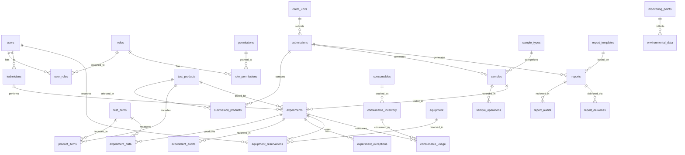

# SmartLis 智能实验室管理系统数据库设计文档

## 1. 数据库概述

### 1.1 数据库选型
- **数据库类型**：Supabase PostgreSQL 15
- **数据库名称**：smartlis
- **字符集**：UTF-8
- **时区**：UTC

### 1.2 命名规范

#### 1.2.1 表命名规范
- 使用小写字母和下划线
- 表名使用复数形式
- 例如：`users`, `samples`, `experiments`

#### 1.2.2 字段命名规范
- 使用小写字母和下划线
- 主键统一使用 `id`
- 外键使用 `{表名}_id` 格式
- 时间字段使用 `created_at`, `updated_at`
- 布尔字段使用 `is_` 前缀

#### 1.2.3 索引命名规范
- 主键索引：`pk_{表名}`
- 外键索引：`fk_{表名}_{字段名}`
- 普通索引：`idx_{表名}_{字段名}`
- 唯一索引：`uk_{表名}_{字段名}`

### 1.3 字段类型规范

| 数据类型 | PostgreSQL类型 | 说明 |
|---------|---------------|------|
| 主键ID | UUID | 使用UUID作为主键 |
| 字符串 | VARCHAR(n) | 根据实际需要设置长度 |
| 长文本 | TEXT | 不限长度的文本 |
| 整数 | INTEGER | 32位整数 |
| 长整数 | BIGINT | 64位整数 |
| 小数 | DECIMAL(p,s) | 精确小数 |
| 布尔值 | BOOLEAN | 真假值 |
| 日期时间 | TIMESTAMP WITH TIME ZONE | 带时区的时间戳 |
| 日期 | DATE | 日期类型 |
| JSON数据 | JSONB | 二进制JSON |
| 枚举 | VARCHAR(50) | 使用字符串存储枚举值 |

## 2. 核心业务表设计

### 2.1 用户权限模块

#### 2.1.1 用户表 (users)
```sql
CREATE TABLE users (
    id UUID PRIMARY KEY DEFAULT gen_random_uuid(),
    username VARCHAR(50) UNIQUE NOT NULL,
    email VARCHAR(100) UNIQUE NOT NULL,
    password_hash VARCHAR(255) NOT NULL,
    real_name VARCHAR(100) NOT NULL,
    phone VARCHAR(20),
    department VARCHAR(100),
    position VARCHAR(100),
    status VARCHAR(20) DEFAULT 'active' CHECK (status IN ('active', 'inactive', 'locked')),
    last_login_at TIMESTAMP WITH TIME ZONE,
    last_login_ip INET,
    created_at TIMESTAMP WITH TIME ZONE DEFAULT NOW(),
    updated_at TIMESTAMP WITH TIME ZONE DEFAULT NOW(),
    created_by UUID,
    updated_by UUID
);

COMMENT ON TABLE users IS '用户表';
COMMENT ON COLUMN users.id IS '用户ID';
COMMENT ON COLUMN users.username IS '用户名';
COMMENT ON COLUMN users.email IS '邮箱';
COMMENT ON COLUMN users.password_hash IS '密码哈希';
COMMENT ON COLUMN users.real_name IS '真实姓名';
COMMENT ON COLUMN users.phone IS '手机号';
COMMENT ON COLUMN users.department IS '部门';
COMMENT ON COLUMN users.position IS '职位';
COMMENT ON COLUMN users.status IS '状态：active-活跃，inactive-非活跃，locked-锁定';
```

#### 2.1.2 角色表 (roles)
```sql
CREATE TABLE roles (
    id UUID PRIMARY KEY DEFAULT gen_random_uuid(),
    name VARCHAR(50) UNIQUE NOT NULL,
    display_name VARCHAR(100) NOT NULL,
    description TEXT,
    is_system BOOLEAN DEFAULT FALSE,
    created_at TIMESTAMP WITH TIME ZONE DEFAULT NOW(),
    updated_at TIMESTAMP WITH TIME ZONE DEFAULT NOW(),
    created_by UUID,
    updated_by UUID
);

COMMENT ON TABLE roles IS '角色表';
COMMENT ON COLUMN roles.name IS '角色名称（英文）';
COMMENT ON COLUMN roles.display_name IS '角色显示名称（中文）';
COMMENT ON COLUMN roles.is_system IS '是否系统角色';
```

#### 2.1.3 权限表 (permissions)
```sql
CREATE TABLE permissions (
    id UUID PRIMARY KEY DEFAULT gen_random_uuid(),
    code VARCHAR(100) UNIQUE NOT NULL,
    name VARCHAR(100) NOT NULL,
    module VARCHAR(50) NOT NULL,
    page_name VARCHAR(100) NOT NULL,
    route_path VARCHAR(200) NOT NULL,
    description TEXT,
    sort_order INTEGER DEFAULT 0,
    is_active BOOLEAN DEFAULT TRUE,
    created_at TIMESTAMP WITH TIME ZONE DEFAULT NOW(),
    updated_at TIMESTAMP WITH TIME ZONE DEFAULT NOW()
);

COMMENT ON TABLE permissions IS '权限表';
COMMENT ON COLUMN permissions.code IS '权限编码';
COMMENT ON COLUMN permissions.name IS '权限名称';
COMMENT ON COLUMN permissions.module IS '所属模块';
COMMENT ON COLUMN permissions.page_name IS '页面名称';
COMMENT ON COLUMN permissions.route_path IS '路由路径';
```

#### 2.1.4 用户角色关联表 (user_roles)
```sql
CREATE TABLE user_roles (
    id UUID PRIMARY KEY DEFAULT gen_random_uuid(),
    user_id UUID NOT NULL REFERENCES users(id) ON DELETE CASCADE,
    role_id UUID NOT NULL REFERENCES roles(id) ON DELETE CASCADE,
    created_at TIMESTAMP WITH TIME ZONE DEFAULT NOW(),
    created_by UUID,
    UNIQUE(user_id, role_id)
);

COMMENT ON TABLE user_roles IS '用户角色关联表';
```

#### 2.1.5 角色权限关联表 (role_permissions)
```sql
CREATE TABLE role_permissions (
    id UUID PRIMARY KEY DEFAULT gen_random_uuid(),
    role_id UUID NOT NULL REFERENCES roles(id) ON DELETE CASCADE,
    permission_id UUID NOT NULL REFERENCES permissions(id) ON DELETE CASCADE,
    created_at TIMESTAMP WITH TIME ZONE DEFAULT NOW(),
    created_by UUID,
    UNIQUE(role_id, permission_id)
);

COMMENT ON TABLE role_permissions IS '角色权限关联表';
```

### 2.2 系统设置模块

#### 2.2.1 样本类型表 (sample_types)
```sql
CREATE TABLE sample_types (
    id UUID PRIMARY KEY DEFAULT gen_random_uuid(),
    code VARCHAR(50) UNIQUE NOT NULL,
    name VARCHAR(100) NOT NULL,
    description TEXT,
    storage_requirements TEXT,
    default_destroy_days INTEGER DEFAULT 30,
    is_active BOOLEAN DEFAULT TRUE,
    sort_order INTEGER DEFAULT 0,
    created_at TIMESTAMP WITH TIME ZONE DEFAULT NOW(),
    updated_at TIMESTAMP WITH TIME ZONE DEFAULT NOW(),
    created_by UUID,
    updated_by UUID
);

COMMENT ON TABLE sample_types IS '样本类型表';
COMMENT ON COLUMN sample_types.code IS '样本类型编码';
COMMENT ON COLUMN sample_types.name IS '样本类型名称';
COMMENT ON COLUMN sample_types.storage_requirements IS '存储要求';
COMMENT ON COLUMN sample_types.default_destroy_days IS '默认销毁天数';
```

#### 2.2.2 检测项目表 (test_items)
```sql
CREATE TABLE test_items (
    id UUID PRIMARY KEY DEFAULT gen_random_uuid(),
    code VARCHAR(50) UNIQUE NOT NULL,
    name VARCHAR(100) NOT NULL,
    category VARCHAR(50) NOT NULL,
    method VARCHAR(50) NOT NULL CHECK (method IN ('routine', 'mass_spec', 'special')),
    unit VARCHAR(20),
    reference_range_male VARCHAR(100),
    reference_range_female VARCHAR(100),
    reference_range_child VARCHAR(100),
    normal_min DECIMAL(10,4),
    normal_max DECIMAL(10,4),
    critical_min DECIMAL(10,4),
    critical_max DECIMAL(10,4),
    is_active BOOLEAN DEFAULT TRUE,
    sort_order INTEGER DEFAULT 0,
    created_at TIMESTAMP WITH TIME ZONE DEFAULT NOW(),
    updated_at TIMESTAMP WITH TIME ZONE DEFAULT NOW(),
    created_by UUID,
    updated_by UUID
);

COMMENT ON TABLE test_items IS '检测项目表';
COMMENT ON COLUMN test_items.method IS '检测方法：routine-普检，mass_spec-质谱，special-特检';
COMMENT ON COLUMN test_items.reference_range_male IS '男性参考范围';
COMMENT ON COLUMN test_items.reference_range_female IS '女性参考范围';
COMMENT ON COLUMN test_items.reference_range_child IS '儿童参考范围';
```

#### 2.2.3 检测产品表 (test_products)
```sql
CREATE TABLE test_products (
    id UUID PRIMARY KEY DEFAULT gen_random_uuid(),
    code VARCHAR(50) UNIQUE NOT NULL,
    name VARCHAR(100) NOT NULL,
    category VARCHAR(50) NOT NULL,
    description TEXT,
    price DECIMAL(10,2),
    turnaround_time INTEGER NOT NULL DEFAULT 24,
    is_active BOOLEAN DEFAULT TRUE,
    sort_order INTEGER DEFAULT 0,
    created_at TIMESTAMP WITH TIME ZONE DEFAULT NOW(),
    updated_at TIMESTAMP WITH TIME ZONE DEFAULT NOW(),
    created_by UUID,
    updated_by UUID
);

COMMENT ON TABLE test_products IS '检测产品表';
COMMENT ON COLUMN test_products.turnaround_time IS '周转时间（小时）';
```

#### 2.2.4 产品项目关联表 (product_items)
```sql
CREATE TABLE product_items (
    id UUID PRIMARY KEY DEFAULT gen_random_uuid(),
    product_id UUID NOT NULL REFERENCES test_products(id) ON DELETE CASCADE,
    item_id UUID NOT NULL REFERENCES test_items(id) ON DELETE CASCADE,
    is_required BOOLEAN DEFAULT TRUE,
    sort_order INTEGER DEFAULT 0,
    created_at TIMESTAMP WITH TIME ZONE DEFAULT NOW(),
    created_by UUID,
    UNIQUE(product_id, item_id)
);

COMMENT ON TABLE product_items IS '产品项目关联表';
```

#### 2.2.5 送检单位表 (client_units)
```sql
CREATE TABLE client_units (
    id UUID PRIMARY KEY DEFAULT gen_random_uuid(),
    code VARCHAR(50) UNIQUE NOT NULL,
    name VARCHAR(200) NOT NULL,
    type VARCHAR(50) NOT NULL,
    contact_person VARCHAR(100),
    contact_phone VARCHAR(20),
    contact_email VARCHAR(100),
    address TEXT,
    contract_info JSONB,
    is_active BOOLEAN DEFAULT TRUE,
    created_at TIMESTAMP WITH TIME ZONE DEFAULT NOW(),
    updated_at TIMESTAMP WITH TIME ZONE DEFAULT NOW(),
    created_by UUID,
    updated_by UUID
);

COMMENT ON TABLE client_units IS '送检单位表';
COMMENT ON COLUMN client_units.type IS '单位类型';
COMMENT ON COLUMN client_units.contract_info IS '合同信息（JSON格式）';
```

#### 2.2.6 实验员表 (technicians)
```sql
CREATE TABLE technicians (
    id UUID PRIMARY KEY DEFAULT gen_random_uuid(),
    user_id UUID NOT NULL REFERENCES users(id) ON DELETE CASCADE,
    employee_no VARCHAR(50) UNIQUE NOT NULL,
    methods JSONB NOT NULL DEFAULT '[]',
    certifications JSONB DEFAULT '[]',
    skills JSONB DEFAULT '[]',
    is_active BOOLEAN DEFAULT TRUE,
    created_at TIMESTAMP WITH TIME ZONE DEFAULT NOW(),
    updated_at TIMESTAMP WITH TIME ZONE DEFAULT NOW(),
    created_by UUID,
    updated_by UUID
);

COMMENT ON TABLE technicians IS '实验员表';
COMMENT ON COLUMN technicians.methods IS '绑定的方法学（JSON数组）';
COMMENT ON COLUMN technicians.certifications IS '资质认证（JSON数组）';
COMMENT ON COLUMN technicians.skills IS '技能列表（JSON数组）';
```

### 2.3 送检管理模块

#### 2.3.1 送检申请表 (submissions)
```sql
CREATE TABLE submissions (
    id UUID PRIMARY KEY DEFAULT gen_random_uuid(),
    submission_no VARCHAR(50) UNIQUE NOT NULL,
    client_unit_id UUID NOT NULL REFERENCES client_units(id),
    patient_name VARCHAR(100) NOT NULL,
    patient_gender VARCHAR(10) CHECK (patient_gender IN ('male', 'female', 'unknown')),
    patient_age INTEGER,
    patient_id_card VARCHAR(50),
    contact_phone VARCHAR(20),
    is_urgent BOOLEAN DEFAULT FALSE,
    clinical_info TEXT,
    sample_info TEXT,
    attachment_urls JSONB DEFAULT '[]',
    total_amount DECIMAL(10,2),
    status VARCHAR(20) DEFAULT 'submitted' CHECK (status IN ('submitted', 'received', 'in_progress', 'completed', 'cancelled', 'abnormal')),
    submitted_at TIMESTAMP WITH TIME ZONE DEFAULT NOW(),
    received_at TIMESTAMP WITH TIME ZONE,
    completed_at TIMESTAMP WITH TIME ZONE,
    created_at TIMESTAMP WITH TIME ZONE DEFAULT NOW(),
    updated_at TIMESTAMP WITH TIME ZONE DEFAULT NOW(),
    created_by UUID,
    updated_by UUID
);

COMMENT ON TABLE submissions IS '送检申请表';
COMMENT ON COLUMN submissions.submission_no IS '送检编号';
COMMENT ON COLUMN submissions.patient_gender IS '患者性别：male-男，female-女，unknown-未知';
COMMENT ON COLUMN submissions.is_urgent IS '是否加急';
COMMENT ON COLUMN submissions.status IS '状态：submitted-已提交，received-已接收，in_progress-进行中，completed-已完成，cancelled-已取消，abnormal-异常';
```

#### 2.3.2 送检产品表 (submission_products)
```sql
CREATE TABLE submission_products (
    id UUID PRIMARY KEY DEFAULT gen_random_uuid(),
    submission_id UUID NOT NULL REFERENCES submissions(id) ON DELETE CASCADE,
    product_id UUID NOT NULL REFERENCES test_products(id),
    quantity INTEGER DEFAULT 1,
    unit_price DECIMAL(10,2),
    total_price DECIMAL(10,2),
    created_at TIMESTAMP WITH TIME ZONE DEFAULT NOW(),
    created_by UUID
);

COMMENT ON TABLE submission_products IS '送检产品表';
```

#### 2.3.3 送检进度表 (submission_progress)
```sql
CREATE TABLE submission_progress (
    id UUID PRIMARY KEY DEFAULT gen_random_uuid(),
    submission_id UUID NOT NULL REFERENCES submissions(id) ON DELETE CASCADE,
    stage VARCHAR(50) NOT NULL,
    status VARCHAR(20) NOT NULL,
    description TEXT,
    operator_id UUID REFERENCES users(id),
    started_at TIMESTAMP WITH TIME ZONE,
    completed_at TIMESTAMP WITH TIME ZONE,
    created_at TIMESTAMP WITH TIME ZONE DEFAULT NOW()
);

COMMENT ON TABLE submission_progress IS '送检进度表';
COMMENT ON COLUMN submission_progress.stage IS '阶段名称';
COMMENT ON COLUMN submission_progress.status IS '阶段状态';
```

### 2.4 样本管理模块

#### 2.4.1 样本表 (samples)
```sql
CREATE TABLE samples (
    id UUID PRIMARY KEY DEFAULT gen_random_uuid(),
    sample_no VARCHAR(50) UNIQUE NOT NULL,
    barcode VARCHAR(100) UNIQUE NOT NULL,
    submission_id UUID NOT NULL REFERENCES submissions(id),
    sample_type_id UUID NOT NULL REFERENCES sample_types(id),
    volume DECIMAL(8,2),
    unit VARCHAR(20) DEFAULT 'ml',
    collection_time TIMESTAMP WITH TIME ZONE,
    received_time TIMESTAMP WITH TIME ZONE,
    storage_location VARCHAR(100),
    storage_temperature VARCHAR(20),
    status VARCHAR(20) DEFAULT 'received' CHECK (status IN ('received', 'in_storage', 'out_for_test', 'testing', 'completed', 'destroyed', 'abnormal')),
    quality_status VARCHAR(20) DEFAULT 'qualified' CHECK (quality_status IN ('qualified', 'unqualified', 'pending')),
    abnormal_reason TEXT,
    destroy_reason TEXT,
    destroy_date DATE,
    expected_destroy_date DATE,
    created_at TIMESTAMP WITH TIME ZONE DEFAULT NOW(),
    updated_at TIMESTAMP WITH TIME ZONE DEFAULT NOW(),
    created_by UUID,
    updated_by UUID
);

COMMENT ON TABLE samples IS '样本表';
COMMENT ON COLUMN samples.sample_no IS '样本编号';
COMMENT ON COLUMN samples.barcode IS '条形码';
COMMENT ON COLUMN samples.status IS '状态：received-已接收，in_storage-在库，out_for_test-出库待检，testing-检测中，completed-已完成，destroyed-已销毁，abnormal-异常';
COMMENT ON COLUMN samples.quality_status IS '质量状态：qualified-合格，unqualified-不合格，pending-待审核';
```

#### 2.4.2 样本操作记录表 (sample_operations)
```sql
CREATE TABLE sample_operations (
    id UUID PRIMARY KEY DEFAULT gen_random_uuid(),
    sample_id UUID NOT NULL REFERENCES samples(id) ON DELETE CASCADE,
    operation_type VARCHAR(50) NOT NULL,
    operation_desc TEXT,
    from_location VARCHAR(100),
    to_location VARCHAR(100),
    volume_before DECIMAL(8,2),
    volume_after DECIMAL(8,2),
    operator_id UUID REFERENCES users(id),
    operation_time TIMESTAMP WITH TIME ZONE DEFAULT NOW(),
    remarks TEXT
);

COMMENT ON TABLE sample_operations IS '样本操作记录表';
COMMENT ON COLUMN sample_operations.operation_type IS '操作类型：receive-接收，outbound-出库，inbound-入库，destroy-销毁';
```

### 2.5 实验管理模块

#### 2.5.1 实验表 (experiments)
```sql
CREATE TABLE experiments (
    id UUID PRIMARY KEY DEFAULT gen_random_uuid(),
    experiment_no VARCHAR(50) UNIQUE NOT NULL,
    sample_id UUID NOT NULL REFERENCES samples(id),
    product_id UUID NOT NULL REFERENCES test_products(id),
    method VARCHAR(50) NOT NULL CHECK (method IN ('routine', 'mass_spec', 'special')),
    technician_id UUID REFERENCES technicians(id),
    equipment_id UUID,
    batch_no VARCHAR(50),
    status VARCHAR(20) DEFAULT 'pending' CHECK (status IN ('pending', 'in_progress', 'completed', 'failed', 'cancelled')),
    started_at TIMESTAMP WITH TIME ZONE,
    completed_at TIMESTAMP WITH TIME ZONE,
    remarks TEXT,
    created_at TIMESTAMP WITH TIME ZONE DEFAULT NOW(),
    updated_at TIMESTAMP WITH TIME ZONE DEFAULT NOW(),
    created_by UUID,
    updated_by UUID
);

COMMENT ON TABLE experiments IS '实验表';
COMMENT ON COLUMN experiments.method IS '实验方法：routine-普检，mass_spec-质谱，special-特检';
COMMENT ON COLUMN experiments.status IS '状态：pending-待开始，in_progress-进行中，completed-已完成，failed-失败，cancelled-已取消';
```

#### 2.5.2 实验数据表 (experiment_data)
```sql
CREATE TABLE experiment_data (
    id UUID PRIMARY KEY DEFAULT gen_random_uuid(),
    experiment_id UUID NOT NULL REFERENCES experiments(id) ON DELETE CASCADE,
    item_id UUID NOT NULL REFERENCES test_items(id),
    result_value VARCHAR(200),
    result_numeric DECIMAL(15,6),
    result_text TEXT,
    unit VARCHAR(20),
    reference_range VARCHAR(100),
    is_abnormal BOOLEAN DEFAULT FALSE,
    abnormal_flag VARCHAR(10),
    quality_control JSONB,
    instrument_data JSONB,
    measured_at TIMESTAMP WITH TIME ZONE,
    created_at TIMESTAMP WITH TIME ZONE DEFAULT NOW(),
    updated_at TIMESTAMP WITH TIME ZONE DEFAULT NOW(),
    created_by UUID,
    updated_by UUID
);

COMMENT ON TABLE experiment_data IS '实验数据表';
COMMENT ON COLUMN experiment_data.result_value IS '结果值（字符串）';
COMMENT ON COLUMN experiment_data.result_numeric IS '结果值（数值）';
COMMENT ON COLUMN experiment_data.abnormal_flag IS '异常标识：H-偏高，L-偏低，HH-严重偏高，LL-严重偏低';
```

#### 2.5.3 实验审核表 (experiment_audits)
```sql
CREATE TABLE experiment_audits (
    id UUID PRIMARY KEY DEFAULT gen_random_uuid(),
    experiment_id UUID NOT NULL REFERENCES experiments(id) ON DELETE CASCADE,
    auditor_id UUID NOT NULL REFERENCES users(id),
    audit_level INTEGER NOT NULL DEFAULT 1,
    audit_result VARCHAR(20) NOT NULL CHECK (audit_result IN ('approved', 'rejected', 'pending')),
    audit_comments TEXT,
    audit_time TIMESTAMP WITH TIME ZONE DEFAULT NOW(),
    created_at TIMESTAMP WITH TIME ZONE DEFAULT NOW()
);

COMMENT ON TABLE experiment_audits IS '实验审核表';
COMMENT ON COLUMN experiment_audits.audit_level IS '审核级别';
COMMENT ON COLUMN experiment_audits.audit_result IS '审核结果：approved-通过，rejected-拒绝，pending-待审核';
```

#### 2.5.4 实验异常表 (experiment_exceptions)
```sql
CREATE TABLE experiment_exceptions (
    id UUID PRIMARY KEY DEFAULT gen_random_uuid(),
    experiment_id UUID NOT NULL REFERENCES experiments(id) ON DELETE CASCADE,
    exception_type VARCHAR(50) NOT NULL,
    exception_desc TEXT NOT NULL,
    severity VARCHAR(20) DEFAULT 'medium' CHECK (severity IN ('low', 'medium', 'high', 'critical')),
    status VARCHAR(20) DEFAULT 'open' CHECK (status IN ('open', 'in_progress', 'resolved', 'closed')),
    resolution TEXT,
    resolver_id UUID REFERENCES users(id),
    resolved_at TIMESTAMP WITH TIME ZONE,
    created_at TIMESTAMP WITH TIME ZONE DEFAULT NOW(),
    updated_at TIMESTAMP WITH TIME ZONE DEFAULT NOW(),
    created_by UUID,
    updated_by UUID
);

COMMENT ON TABLE experiment_exceptions IS '实验异常表';
COMMENT ON COLUMN experiment_exceptions.exception_type IS '异常类型';
COMMENT ON COLUMN experiment_exceptions.severity IS '严重程度：low-低，medium-中，high-高，critical-严重';
```

### 2.6 报告管理模块

#### 2.6.1 报告模板表 (report_templates)
```sql
CREATE TABLE report_templates (
    id UUID PRIMARY KEY DEFAULT gen_random_uuid(),
    name VARCHAR(100) NOT NULL,
    category VARCHAR(50) NOT NULL,
    template_content TEXT NOT NULL,
    template_format VARCHAR(20) DEFAULT 'html',
    is_default BOOLEAN DEFAULT FALSE,
    is_active BOOLEAN DEFAULT TRUE,
    version VARCHAR(20) DEFAULT '1.0',
    created_at TIMESTAMP WITH TIME ZONE DEFAULT NOW(),
    updated_at TIMESTAMP WITH TIME ZONE DEFAULT NOW(),
    created_by UUID,
    updated_by UUID
);

COMMENT ON TABLE report_templates IS '报告模板表';
COMMENT ON COLUMN report_templates.template_format IS '模板格式：html, docx, pdf';
```

#### 2.6.2 报告表 (reports)
```sql
CREATE TABLE reports (
    id UUID PRIMARY KEY DEFAULT gen_random_uuid(),
    report_no VARCHAR(50) UNIQUE NOT NULL,
    submission_id UUID NOT NULL REFERENCES submissions(id),
    template_id UUID REFERENCES report_templates(id),
    title VARCHAR(200) NOT NULL,
    content TEXT,
    summary TEXT,
    conclusion TEXT,
    recommendations TEXT,
    status VARCHAR(20) DEFAULT 'draft' CHECK (status IN ('draft', 'pending_review', 'approved', 'delivered', 'cancelled')),
    generated_at TIMESTAMP WITH TIME ZONE,
    delivered_at TIMESTAMP WITH TIME ZONE,
    file_urls JSONB DEFAULT '[]',
    created_at TIMESTAMP WITH TIME ZONE DEFAULT NOW(),
    updated_at TIMESTAMP WITH TIME ZONE DEFAULT NOW(),
    created_by UUID,
    updated_by UUID
);

COMMENT ON TABLE reports IS '报告表';
COMMENT ON COLUMN reports.status IS '状态：draft-草稿，pending_review-待审核，approved-已审核，delivered-已交付，cancelled-已取消';
COMMENT ON COLUMN reports.file_urls IS '报告文件URL列表（JSON数组）';
```

#### 2.6.3 报告审核表 (report_audits)
```sql
CREATE TABLE report_audits (
    id UUID PRIMARY KEY DEFAULT gen_random_uuid(),
    report_id UUID NOT NULL REFERENCES reports(id) ON DELETE CASCADE,
    auditor_id UUID NOT NULL REFERENCES users(id),
    audit_level INTEGER NOT NULL DEFAULT 1,
    audit_result VARCHAR(20) NOT NULL CHECK (audit_result IN ('approved', 'rejected', 'pending')),
    audit_comments TEXT,
    audit_time TIMESTAMP WITH TIME ZONE DEFAULT NOW(),
    created_at TIMESTAMP WITH TIME ZONE DEFAULT NOW()
);

COMMENT ON TABLE report_audits IS '报告审核表';
```

#### 2.6.4 报告交付记录表 (report_deliveries)
```sql
CREATE TABLE report_deliveries (
    id UUID PRIMARY KEY DEFAULT gen_random_uuid(),
    report_id UUID NOT NULL REFERENCES reports(id) ON DELETE CASCADE,
    delivery_method VARCHAR(50) NOT NULL,
    recipient_name VARCHAR(100),
    recipient_contact VARCHAR(100),
    delivery_status VARCHAR(20) DEFAULT 'pending' CHECK (delivery_status IN ('pending', 'delivered', 'failed', 'cancelled')),
    delivery_time TIMESTAMP WITH TIME ZONE,
    tracking_info JSONB,
    remarks TEXT,
    created_at TIMESTAMP WITH TIME ZONE DEFAULT NOW(),
    updated_at TIMESTAMP WITH TIME ZONE DEFAULT NOW(),
    created_by UUID,
    updated_by UUID
);

COMMENT ON TABLE report_deliveries IS '报告交付记录表';
COMMENT ON COLUMN report_deliveries.delivery_method IS '交付方式：email, download, print, courier';
```

### 2.7 实验室管理模块

#### 2.7.1 设备表 (equipment)
```sql
CREATE TABLE equipment (
    id UUID PRIMARY KEY DEFAULT gen_random_uuid(),
    equipment_no VARCHAR(50) UNIQUE NOT NULL,
    name VARCHAR(100) NOT NULL,
    model VARCHAR(100),
    manufacturer VARCHAR(100),
    serial_number VARCHAR(100),
    category VARCHAR(50) NOT NULL,
    location VARCHAR(100),
    purchase_date DATE,
    warranty_end_date DATE,
    supplier VARCHAR(100),
    purchase_price DECIMAL(12,2),
    status VARCHAR(20) DEFAULT 'available' CHECK (status IN ('available', 'in_use', 'maintenance', 'fault', 'retired')),
    last_maintenance_date DATE,
    next_maintenance_date DATE,
    last_calibration_date DATE,
    next_calibration_date DATE,
    specifications JSONB,
    maintenance_records JSONB DEFAULT '[]',
    created_at TIMESTAMP WITH TIME ZONE DEFAULT NOW(),
    updated_at TIMESTAMP WITH TIME ZONE DEFAULT NOW(),
    created_by UUID,
    updated_by UUID
);

COMMENT ON TABLE equipment IS '设备表';
COMMENT ON COLUMN equipment.status IS '状态：available-可用，in_use-使用中，maintenance-维护中，fault-故障，retired-报废';
```

#### 2.7.2 设备预约表 (equipment_reservations)
```sql
CREATE TABLE equipment_reservations (
    id UUID PRIMARY KEY DEFAULT gen_random_uuid(),
    equipment_id UUID NOT NULL REFERENCES equipment(id),
    user_id UUID NOT NULL REFERENCES users(id),
    experiment_id UUID REFERENCES experiments(id),
    start_time TIMESTAMP WITH TIME ZONE NOT NULL,
    end_time TIMESTAMP WITH TIME ZONE NOT NULL,
    purpose TEXT,
    status VARCHAR(20) DEFAULT 'reserved' CHECK (status IN ('reserved', 'in_use', 'completed', 'cancelled')),
    actual_start_time TIMESTAMP WITH TIME ZONE,
    actual_end_time TIMESTAMP WITH TIME ZONE,
    usage_notes TEXT,
    created_at TIMESTAMP WITH TIME ZONE DEFAULT NOW(),
    updated_at TIMESTAMP WITH TIME ZONE DEFAULT NOW(),
    created_by UUID,
    updated_by UUID
);

COMMENT ON TABLE equipment_reservations IS '设备预约表';
```

#### 2.7.3 耗材表 (consumables)
```sql
CREATE TABLE consumables (
    id UUID PRIMARY KEY DEFAULT gen_random_uuid(),
    item_no VARCHAR(50) UNIQUE NOT NULL,
    name VARCHAR(100) NOT NULL,
    category VARCHAR(50) NOT NULL,
    specification VARCHAR(100),
    unit VARCHAR(20) NOT NULL,
    supplier VARCHAR(100),
    manufacturer VARCHAR(100),
    storage_conditions TEXT,
    safety_level VARCHAR(20),
    min_stock_level INTEGER DEFAULT 0,
    max_stock_level INTEGER,
    current_stock INTEGER DEFAULT 0,
    unit_price DECIMAL(10,4),
    is_active BOOLEAN DEFAULT TRUE,
    created_at TIMESTAMP WITH TIME ZONE DEFAULT NOW(),
    updated_at TIMESTAMP WITH TIME ZONE DEFAULT NOW(),
    created_by UUID,
    updated_by UUID
);

COMMENT ON TABLE consumables IS '耗材表';
COMMENT ON COLUMN consumables.safety_level IS '安全等级';
```

#### 2.7.4 耗材库存表 (consumable_inventory)
```sql
CREATE TABLE consumable_inventory (
    id UUID PRIMARY KEY DEFAULT gen_random_uuid(),
    consumable_id UUID NOT NULL REFERENCES consumables(id),
    batch_no VARCHAR(50) NOT NULL,
    quantity INTEGER NOT NULL,
    unit_price DECIMAL(10,4),
    expiry_date DATE,
    received_date DATE DEFAULT CURRENT_DATE,
    location VARCHAR(100),
    status VARCHAR(20) DEFAULT 'available' CHECK (status IN ('available', 'reserved', 'expired', 'consumed')),
    created_at TIMESTAMP WITH TIME ZONE DEFAULT NOW(),
    updated_at TIMESTAMP WITH TIME ZONE DEFAULT NOW(),
    created_by UUID,
    updated_by UUID
);

COMMENT ON TABLE consumable_inventory IS '耗材库存表';
```

#### 2.7.5 耗材使用记录表 (consumable_usage)
```sql
CREATE TABLE consumable_usage (
    id UUID PRIMARY KEY DEFAULT gen_random_uuid(),
    inventory_id UUID NOT NULL REFERENCES consumable_inventory(id),
    experiment_id UUID REFERENCES experiments(id),
    user_id UUID NOT NULL REFERENCES users(id),
    quantity_used INTEGER NOT NULL,
    usage_date DATE DEFAULT CURRENT_DATE,
    purpose TEXT,
    remarks TEXT,
    created_at TIMESTAMP WITH TIME ZONE DEFAULT NOW(),
    created_by UUID
);

COMMENT ON TABLE consumable_usage IS '耗材使用记录表';
```

### 2.8 环境管理模块

#### 2.8.1 环境监控点表 (monitoring_points)
```sql
CREATE TABLE monitoring_points (
    id UUID PRIMARY KEY DEFAULT gen_random_uuid(),
    point_no VARCHAR(50) UNIQUE NOT NULL,
    name VARCHAR(100) NOT NULL,
    location VARCHAR(100) NOT NULL,
    room VARCHAR(50),
    sensor_type VARCHAR(50) NOT NULL,
    parameters JSONB NOT NULL,
    thresholds JSONB NOT NULL,
    is_active BOOLEAN DEFAULT TRUE,
    created_at TIMESTAMP WITH TIME ZONE DEFAULT NOW(),
    updated_at TIMESTAMP WITH TIME ZONE DEFAULT NOW(),
    created_by UUID,
    updated_by UUID
);

COMMENT ON TABLE monitoring_points IS '环境监控点表';
COMMENT ON COLUMN monitoring_points.parameters IS '监控参数配置（JSON）';
COMMENT ON COLUMN monitoring_points.thresholds IS '阈值配置（JSON）';
```

#### 2.8.2 环境数据表 (environmental_data)
```sql
CREATE TABLE environmental_data (
    id UUID PRIMARY KEY DEFAULT gen_random_uuid(),
    point_id UUID NOT NULL REFERENCES monitoring_points(id),
    temperature DECIMAL(5,2),
    humidity DECIMAL(5,2),
    pressure DECIMAL(8,2),
    air_quality DECIMAL(8,2),
    gas_concentration JSONB,
    measured_at TIMESTAMP WITH TIME ZONE NOT NULL,
    is_abnormal BOOLEAN DEFAULT FALSE,
    abnormal_params JSONB,
    created_at TIMESTAMP WITH TIME ZONE DEFAULT NOW()
);

COMMENT ON TABLE environmental_data IS '环境数据表';
COMMENT ON COLUMN environmental_data.gas_concentration IS '气体浓度数据（JSON）';
COMMENT ON COLUMN environmental_data.abnormal_params IS '异常参数（JSON）';
```

### 2.9 系统管理模块

#### 2.9.1 系统配置表 (system_configs)
```sql
CREATE TABLE system_configs (
    id UUID PRIMARY KEY DEFAULT gen_random_uuid(),
    config_key VARCHAR(100) UNIQUE NOT NULL,
    config_value TEXT,
    config_type VARCHAR(50) DEFAULT 'string',
    category VARCHAR(50) NOT NULL,
    description TEXT,
    is_encrypted BOOLEAN DEFAULT FALSE,
    is_system BOOLEAN DEFAULT FALSE,
    created_at TIMESTAMP WITH TIME ZONE DEFAULT NOW(),
    updated_at TIMESTAMP WITH TIME ZONE DEFAULT NOW(),
    created_by UUID,
    updated_by UUID
);

COMMENT ON TABLE system_configs IS '系统配置表';
COMMENT ON COLUMN system_configs.config_type IS '配置类型：string, number, boolean, json';
```

#### 2.9.2 系统日志表 (system_logs)
```sql
CREATE TABLE system_logs (
    id UUID PRIMARY KEY DEFAULT gen_random_uuid(),
    log_level VARCHAR(20) NOT NULL,
    log_type VARCHAR(50) NOT NULL,
    module VARCHAR(50),
    action VARCHAR(100),
    user_id UUID REFERENCES users(id),
    ip_address INET,
    user_agent TEXT,
    request_url TEXT,
    request_method VARCHAR(10),
    request_params JSONB,
    response_status INTEGER,
    execution_time INTEGER,
    error_message TEXT,
    stack_trace TEXT,
    created_at TIMESTAMP WITH TIME ZONE DEFAULT NOW()
);

COMMENT ON TABLE system_logs IS '系统日志表';
COMMENT ON COLUMN system_logs.log_level IS '日志级别：DEBUG, INFO, WARN, ERROR';
COMMENT ON COLUMN system_logs.log_type IS '日志类型：operation, security, error, performance';
```

#### 2.9.3 通知表 (notifications)
```sql
CREATE TABLE notifications (
    id UUID PRIMARY KEY DEFAULT gen_random_uuid(),
    title VARCHAR(200) NOT NULL,
    content TEXT NOT NULL,
    type VARCHAR(50) NOT NULL,
    priority VARCHAR(20) DEFAULT 'normal' CHECK (priority IN ('low', 'normal', 'high', 'urgent')),
    target_users JSONB,
    target_roles JSONB,
    channels JSONB NOT NULL,
    status VARCHAR(20) DEFAULT 'pending' CHECK (status IN ('pending', 'sent', 'failed', 'cancelled')),
    scheduled_at TIMESTAMP WITH TIME ZONE,
    sent_at TIMESTAMP WITH TIME ZONE,
    delivery_status JSONB,
    created_at TIMESTAMP WITH TIME ZONE DEFAULT NOW(),
    updated_at TIMESTAMP WITH TIME ZONE DEFAULT NOW(),
    created_by UUID,
    updated_by UUID
);

COMMENT ON TABLE notifications IS '通知表';
COMMENT ON COLUMN notifications.channels IS '通知渠道：email, sms, system';
COMMENT ON COLUMN notifications.delivery_status IS '各渠道发送状态（JSON）';
```

## 3. 数据关系设计

### 3.1 ER图设计



### 3.2 主要外键关系

| 子表 | 外键字段 | 父表 | 关系类型 | 约束 |
|------|----------|------|----------|------|
| user_roles | user_id | users | 多对多 | CASCADE |
| user_roles | role_id | roles | 多对多 | CASCADE |
| role_permissions | role_id | roles | 多对多 | CASCADE |
| role_permissions | permission_id | permissions | 多对多 | CASCADE |
| technicians | user_id | users | 一对一 | CASCADE |
| submissions | client_unit_id | client_units | 多对一 | RESTRICT |
| submission_products | submission_id | submissions | 一对多 | CASCADE |
| submission_products | product_id | test_products | 多对一 | RESTRICT |
| samples | submission_id | submissions | 一对多 | RESTRICT |
| samples | sample_type_id | sample_types | 多对一 | RESTRICT |
| experiments | sample_id | samples | 一对多 | RESTRICT |
| experiments | technician_id | technicians | 多对一 | SET NULL |
| experiment_data | experiment_id | experiments | 一对多 | CASCADE |
| experiment_data | item_id | test_items | 多对一 | RESTRICT |
| reports | submission_id | submissions | 一对一 | RESTRICT |
| reports | template_id | report_templates | 多对一 | SET NULL |

## 4. 索引设计

### 4.1 主键索引
所有表都使用UUID作为主键，自动创建主键索引。

### 4.2 唯一索引
```sql
-- 用户表
CREATE UNIQUE INDEX uk_users_username ON users(username);
CREATE UNIQUE INDEX uk_users_email ON users(email);

-- 送检申请表
CREATE UNIQUE INDEX uk_submissions_no ON submissions(submission_no);

-- 样本表
CREATE UNIQUE INDEX uk_samples_no ON samples(sample_no);
CREATE UNIQUE INDEX uk_samples_barcode ON samples(barcode);

-- 实验表
CREATE UNIQUE INDEX uk_experiments_no ON experiments(experiment_no);

-- 报告表
CREATE UNIQUE INDEX uk_reports_no ON reports(report_no);

-- 设备表
CREATE UNIQUE INDEX uk_equipment_no ON equipment(equipment_no);

-- 耗材表
CREATE UNIQUE INDEX uk_consumables_item_no ON consumables(item_no);
```

### 4.3 外键索引
```sql
-- 用户角色关联表
CREATE INDEX idx_user_roles_user_id ON user_roles(user_id);
CREATE INDEX idx_user_roles_role_id ON user_roles(role_id);

-- 送检相关
CREATE INDEX idx_submissions_client_unit_id ON submissions(client_unit_id);
CREATE INDEX idx_submissions_status ON submissions(status);
CREATE INDEX idx_submissions_submitted_at ON submissions(submitted_at);

-- 样本相关
CREATE INDEX idx_samples_submission_id ON samples(submission_id);
CREATE INDEX idx_samples_sample_type_id ON samples(sample_type_id);
CREATE INDEX idx_samples_status ON samples(status);
CREATE INDEX idx_samples_received_time ON samples(received_time);

-- 实验相关
CREATE INDEX idx_experiments_sample_id ON experiments(sample_id);
CREATE INDEX idx_experiments_technician_id ON experiments(technician_id);
CREATE INDEX idx_experiments_status ON experiments(status);
CREATE INDEX idx_experiments_method ON experiments(method);
CREATE INDEX idx_experiments_started_at ON experiments(started_at);

-- 实验数据
CREATE INDEX idx_experiment_data_experiment_id ON experiment_data(experiment_id);
CREATE INDEX idx_experiment_data_item_id ON experiment_data(item_id);

-- 报告相关
CREATE INDEX idx_reports_submission_id ON reports(submission_id);
CREATE INDEX idx_reports_status ON reports(status);
CREATE INDEX idx_reports_generated_at ON reports(generated_at);
```

### 4.4 复合索引
```sql
-- 用户状态和创建时间复合索引
CREATE INDEX idx_users_status_created ON users(status, created_at);

-- 样本状态和类型复合索引
CREATE INDEX idx_samples_status_type ON samples(status, sample_type_id);

-- 实验方法和状态复合索引
CREATE INDEX idx_experiments_method_status ON experiments(method, status);

-- 环境数据时间和监控点复合索引
CREATE INDEX idx_environmental_data_point_time ON environmental_data(point_id, measured_at);

-- 系统日志类型和时间复合索引
CREATE INDEX idx_system_logs_type_time ON system_logs(log_type, created_at);
```

### 4.5 部分索引
```sql
-- 活跃用户索引
CREATE INDEX idx_users_active ON users(id) WHERE status = 'active';

-- 异常样本索引
CREATE INDEX idx_samples_abnormal ON samples(id) WHERE status = 'abnormal';

-- 未完成实验索引
CREATE INDEX idx_experiments_pending ON experiments(id) WHERE status IN ('pending', 'in_progress');

-- 待审核报告索引
CREATE INDEX idx_reports_pending_review ON reports(id) WHERE status = 'pending_review';
```

## 5. 数据字典

### 5.1 枚举值定义

#### 5.1.1 用户状态 (user_status)
| 值 | 说明 | 备注 |
|----|------|------|
| active | 活跃 | 正常使用状态 |
| inactive | 非活跃 | 暂时停用 |
| locked | 锁定 | 因安全原因锁定 |

#### 5.1.2 性别 (gender)
| 值 | 说明 | 备注 |
|----|------|------|
| male | 男性 | |
| female | 女性 | |
| unknown | 未知 | 未提供或不适用 |

#### 5.1.3 送检状态 (submission_status)
| 值 | 说明 | 备注 |
|----|------|------|
| submitted | 已提交 | 送检申请已提交 |
| received | 已接收 | 样本已接收 |
| in_progress | 进行中 | 实验进行中 |
| completed | 已完成 | 报告已生成 |
| cancelled | 已取消 | 送检已取消 |
| abnormal | 异常 | 存在异常情况 |

#### 5.1.4 样本状态 (sample_status)
| 值 | 说明 | 备注 |
|----|------|------|
| received | 已接收 | 样本已接收入库 |
| in_storage | 在库 | 样本在库存储 |
| out_for_test | 出库待检 | 样本已出库待检测 |
| testing | 检测中 | 样本正在检测 |
| completed | 已完成 | 检测已完成 |
| destroyed | 已销毁 | 样本已销毁 |
| abnormal | 异常 | 样本存在异常 |

#### 5.1.5 实验方法 (experiment_method)
| 值 | 说明 | 备注 |
|----|------|------|
| routine | 普检 | 常规检测方法 |
| mass_spec | 质谱 | 质谱检测方法 |
| special | 特检 | 特殊检测方法 |

#### 5.1.6 实验状态 (experiment_status)
| 值 | 说明 | 备注 |
|----|------|------|
| pending | 待开始 | 实验待开始 |
| in_progress | 进行中 | 实验进行中 |
| completed | 已完成 | 实验已完成 |
| failed | 失败 | 实验失败 |
| cancelled | 已取消 | 实验已取消 |

#### 5.1.7 报告状态 (report_status)
| 值 | 说明 | 备注 |
|----|------|------|
| draft | 草稿 | 报告草稿状态 |
| pending_review | 待审核 | 报告待审核 |
| approved | 已审核 | 报告已审核通过 |
| delivered | 已交付 | 报告已交付 |
| cancelled | 已取消 | 报告已取消 |

#### 5.1.8 设备状态 (equipment_status)
| 值 | 说明 | 备注 |
|----|------|------|
| available | 可用 | 设备可正常使用 |
| in_use | 使用中 | 设备正在使用 |
| maintenance | 维护中 | 设备正在维护 |
| fault | 故障 | 设备故障 |
| retired | 报废 | 设备已报废 |

### 5.2 业务规则说明

#### 5.2.1 编号生成规则
- **送检编号**：格式为 `SB{YYYYMMDD}{序号4位}`，如 `SB202401010001`
- **样本编号**：格式为 `SP{YYYYMMDD}{序号4位}`，如 `SP202401010001`
- **实验编号**：格式为 `EX{YYYYMMDD}{序号4位}`，如 `EX202401010001`
- **报告编号**：格式为 `RP{YYYYMMDD}{序号4位}`，如 `RP202401010001`
- **设备编号**：格式为 `EQ{类别2位}{序号4位}`，如 `EQ010001`

#### 5.2.2 时间相关规则
- 所有时间字段使用 `TIMESTAMP WITH TIME ZONE` 类型
- 系统默认时区为 UTC
- 创建时间和更新时间自动维护
- 业务时间（如样本接收时间）需要手动设置

#### 5.2.3 数据完整性规则
- 用户删除时，相关记录的创建者和更新者字段设置为 NULL
- 样本删除时，相关实验记录保留但标记为异常
- 实验删除时，相关实验数据级联删除
- 报告删除时，相关审核记录级联删除

## 6. 数据库优化

### 6.1 索引策略

#### 6.1.1 查询优化索引
```sql
-- 基于业务查询频率的索引
CREATE INDEX idx_submissions_date_status ON submissions(DATE(submitted_at), status);
CREATE INDEX idx_samples_type_status_date ON samples(sample_type_id, status, received_time);
CREATE INDEX idx_experiments_method_date ON experiments(method, started_at);
CREATE INDEX idx_reports_status_date ON reports(status, generated_at);

-- 统计查询优化索引
CREATE INDEX idx_experiment_data_item_date ON experiment_data(item_id, DATE(created_at));
CREATE INDEX idx_environmental_data_point_date ON environmental_data(point_id, DATE(measured_at));
```

#### 6.1.2 全文搜索索引
```sql
-- 为文本搜索创建GIN索引
CREATE INDEX idx_submissions_search ON submissions USING gin(to_tsvector('english', patient_name || ' ' || COALESCE(clinical_info, '')));
CREATE INDEX idx_reports_search ON reports USING gin(to_tsvector('english', title || ' ' || COALESCE(content, '')));
```

### 6.2 分区策略

#### 6.2.1 时间分区表
```sql
-- 系统日志按月分区
CREATE TABLE system_logs_partitioned (
    LIKE system_logs INCLUDING ALL
) PARTITION BY RANGE (created_at);

-- 创建月度分区
CREATE TABLE system_logs_2024_01 PARTITION OF system_logs_partitioned
    FOR VALUES FROM ('2024-01-01') TO ('2024-02-01');

CREATE TABLE system_logs_2024_02 PARTITION OF system_logs_partitioned
    FOR VALUES FROM ('2024-02-01') TO ('2024-03-01');

-- 环境数据按月分区
CREATE TABLE environmental_data_partitioned (
    LIKE environmental_data INCLUDING ALL
) PARTITION BY RANGE (measured_at);
```

#### 6.2.2 哈希分区表
```sql
-- 大量实验数据按哈希分区
CREATE TABLE experiment_data_partitioned (
    LIKE experiment_data INCLUDING ALL
) PARTITION BY HASH (experiment_id);

-- 创建4个哈希分区
CREATE TABLE experiment_data_part_0 PARTITION OF experiment_data_partitioned
    FOR VALUES WITH (modulus 4, remainder 0);

CREATE TABLE experiment_data_part_1 PARTITION OF experiment_data_partitioned
    FOR VALUES WITH (modulus 4, remainder 1);

CREATE TABLE experiment_data_part_2 PARTITION OF experiment_data_partitioned
    FOR VALUES WITH (modulus 4, remainder 2);

CREATE TABLE experiment_data_part_3 PARTITION OF experiment_data_partitioned
    FOR VALUES WITH (modulus 4, remainder 3);
```

### 6.3 性能优化建议

#### 6.3.1 查询优化
- 使用 EXPLAIN ANALYZE 分析查询计划
- 避免 SELECT * 查询，只选择需要的字段
- 合理使用 LIMIT 和 OFFSET
- 使用 EXISTS 代替 IN 子查询
- 合理使用 JOIN 类型

#### 6.3.2 写入优化
- 批量插入使用 COPY 或 INSERT ... VALUES 多行
- 合理使用事务，避免长事务
- 延迟约束检查到事务提交时
- 使用 UPSERT (INSERT ... ON CONFLICT) 处理冲突

#### 6.3.3 维护优化
```sql
-- 定期更新表统计信息
ANALYZE;

-- 定期清理无用数据
VACUUM;

-- 重建索引（如需要）
REINDEX INDEX idx_name;

-- 检查表膨胀
SELECT schemaname, tablename, attname, n_distinct, correlation
FROM pg_stats
WHERE schemaname = 'public';
```

## 7. 数据安全设计

### 7.1 敏感数据处理

#### 7.1.1 数据分类
| 敏感级别 | 数据类型 | 处理方式 |
|----------|----------|----------|
| 高敏感 | 密码、身份证号 | 加密存储 |
| 中敏感 | 手机号、邮箱 | 脱敏显示 |
| 低敏感 | 姓名、地址 | 访问控制 |
| 公开 | 系统配置、枚举值 | 正常处理 |

#### 7.1.2 加密存储
```sql
-- 创建加密函数
CREATE OR REPLACE FUNCTION encrypt_sensitive_data(data TEXT)
RETURNS TEXT AS $$
BEGIN
    RETURN encode(encrypt(data::bytea, 'encryption_key', 'aes'), 'base64');
END;
$$ LANGUAGE plpgsql;

-- 创建解密函数
CREATE OR REPLACE FUNCTION decrypt_sensitive_data(encrypted_data TEXT)
RETURNS TEXT AS $$
BEGIN
    RETURN convert_from(decrypt(decode(encrypted_data, 'base64'), 'encryption_key', 'aes'), 'UTF8');
END;
$$ LANGUAGE plpgsql;
```

#### 7.1.3 数据脱敏
```sql
-- 手机号脱敏函数
CREATE OR REPLACE FUNCTION mask_phone(phone TEXT)
RETURNS TEXT AS $$
BEGIN
    IF phone IS NULL OR LENGTH(phone) < 7 THEN
        RETURN phone;
    END IF;
    RETURN LEFT(phone, 3) || '****' || RIGHT(phone, 4);
END;
$$ LANGUAGE plpgsql;

-- 邮箱脱敏函数
CREATE OR REPLACE FUNCTION mask_email(email TEXT)
RETURNS TEXT AS $$
DECLARE
    at_pos INTEGER;
BEGIN
    IF email IS NULL THEN
        RETURN email;
    END IF;
    at_pos := POSITION('@' IN email);
    IF at_pos <= 1 THEN
        RETURN email;
    END IF;
    RETURN LEFT(email, 1) || '***' || SUBSTRING(email FROM at_pos);
END;
$$ LANGUAGE plpgsql;
```

### 7.2 数据备份策略

#### 7.2.1 备份计划
| 备份类型 | 频率 | 保留期 | 存储位置 |
|----------|------|--------|----------|
| 全量备份 | 每日 | 30天 | 云存储 |
| 增量备份 | 每小时 | 7天 | 本地存储 |
| 事务日志备份 | 每15分钟 | 24小时 | 本地存储 |
| 归档备份 | 每月 | 1年 | 异地存储 |

#### 7.2.2 备份脚本
```bash
#!/bin/bash
# 全量备份脚本
BACKUP_DIR="/backup/postgresql"
DATE=$(date +%Y%m%d_%H%M%S)
DATABASE="smartlis"

# 创建备份目录
mkdir -p $BACKUP_DIR

# 执行备份
pg_dump -h localhost -U postgres -d $DATABASE -f $BACKUP_DIR/smartlis_full_$DATE.sql

# 压缩备份文件
gzip $BACKUP_DIR/smartlis_full_$DATE.sql

# 删除7天前的备份
find $BACKUP_DIR -name "smartlis_full_*.sql.gz" -mtime +7 -delete

echo "Backup completed: smartlis_full_$DATE.sql.gz"
```

#### 7.2.3 恢复策略
```sql
-- 恢复数据库
-- 1. 停止应用服务
-- 2. 创建新数据库
CREATE DATABASE smartlis_restore;

-- 3. 恢复数据
-- psql -h localhost -U postgres -d smartlis_restore -f backup_file.sql

-- 4. 验证数据完整性
SELECT COUNT(*) FROM users;
SELECT COUNT(*) FROM submissions;
SELECT COUNT(*) FROM samples;

-- 5. 切换数据库连接
-- 6. 重启应用服务
```

### 7.3 权限控制设计

#### 7.3.1 数据库用户角色
```sql
-- 创建应用用户
CREATE USER smartlis_app WITH PASSWORD 'secure_password';

-- 创建只读用户
CREATE USER smartlis_readonly WITH PASSWORD 'readonly_password';

-- 创建备份用户
CREATE USER smartlis_backup WITH PASSWORD 'backup_password';

-- 授权应用用户
GRANT CONNECT ON DATABASE smartlis TO smartlis_app;
GRANT USAGE ON SCHEMA public TO smartlis_app;
GRANT SELECT, INSERT, UPDATE, DELETE ON ALL TABLES IN SCHEMA public TO smartlis_app;
GRANT USAGE, SELECT ON ALL SEQUENCES IN SCHEMA public TO smartlis_app;

-- 授权只读用户
GRANT CONNECT ON DATABASE smartlis TO smartlis_readonly;
GRANT USAGE ON SCHEMA public TO smartlis_readonly;
GRANT SELECT ON ALL TABLES IN SCHEMA public TO smartlis_readonly;

-- 授权备份用户
GRANT CONNECT ON DATABASE smartlis TO smartlis_backup;
ALTER USER smartlis_backup WITH REPLICATION;
```

#### 7.3.2 行级安全策略
```sql
-- 启用行级安全
ALTER TABLE users ENABLE ROW LEVEL SECURITY;
ALTER TABLE submissions ENABLE ROW LEVEL SECURITY;
ALTER TABLE samples ENABLE ROW LEVEL SECURITY;

-- 用户只能查看自己的记录
CREATE POLICY user_self_policy ON users
    FOR ALL TO smartlis_app
    USING (id = current_setting('app.current_user_id')::UUID);

-- 送检记录访问策略
CREATE POLICY submission_access_policy ON submissions
    FOR ALL TO smartlis_app
    USING (
        created_by = current_setting('app.current_user_id')::UUID
        OR EXISTS (
            SELECT 1 FROM user_roles ur
            JOIN roles r ON ur.role_id = r.id
            WHERE ur.user_id = current_setting('app.current_user_id')::UUID
            AND r.name IN ('admin', 'lab_manager')
        )
    );
```

## 8. 数据初始化

### 8.1 基础数据初始化

#### 8.1.1 系统角色初始化
```sql
-- 插入系统角色
INSERT INTO roles (id, name, display_name, description, is_system) VALUES
(gen_random_uuid(), 'admin', '系统管理员', '系统管理员，拥有所有权限', true),
(gen_random_uuid(), 'lab_manager', '实验室管理员', '实验室管理员，管理实验室日常运营', true),
(gen_random_uuid(), 'technician', '实验员', '实验员，执行实验操作', true),
(gen_random_uuid(), 'engineer', '研发工程师', '研发工程师，提交送检申请', true),
(gen_random_uuid(), 'maintenance', '设备维护工程师', '设备维护工程师，负责设备维护', true);
```

#### 8.1.2 系统权限初始化
```sql
-- 插入系统权限
INSERT INTO permissions (id, code, name, module, page_name, route_path, description, sort_order) VALUES
-- 首页模块
(gen_random_uuid(), 'dashboard', '首页', 'dashboard', '首页', '/dashboard', '系统首页和数据看板', 1),
-- 送检管理模块
(gen_random_uuid(), 'submission_apply', '送检申请', 'submission', '送检申请', '/submission/apply', '提交送检申请', 10),
(gen_random_uuid(), 'submission_progress', '送检进度查询', 'submission', '送检进度查询', '/submission/progress', '查询送检进度', 11),
(gen_random_uuid(), 'submission_reports', '报告交付', 'submission', '报告交付', '/submission/reports', '报告下载和交付', 12),
-- 样本管理模块
(gen_random_uuid(), 'sample_receive', '样本接收', 'sample', '样本接收', '/sample/receive', '样本接收处理', 20),
(gen_random_uuid(), 'sample_query', '样本查询', 'sample', '样本查询', '/sample/query', '样本信息查询', 21),
(gen_random_uuid(), 'sample_audit', '样本审核', 'sample', '样本审核', '/sample/audit', '样本审核处理', 22),
(gen_random_uuid(), 'sample_outbound', '样本出库', 'sample', '样本出库', '/sample/outbound', '样本出库管理', 23),
(gen_random_uuid(), 'sample_inbound', '样本入库', 'sample', '样本入库', '/sample/inbound', '样本入库管理', 24),
(gen_random_uuid(), 'sample_destroy', '样本销毁', 'sample', '样本销毁', '/sample/destroy', '样本销毁处理', 25),
-- 普检实验管理模块
(gen_random_uuid(), 'experiment_routine', '普检实验', 'experiment', '普检实验', '/experiment/routine', '普检实验操作', 30),
(gen_random_uuid(), 'experiment_routine_audit', '普检数据审核', 'experiment', '普检数据审核', '/experiment/routine/audit', '普检数据审核', 31),
(gen_random_uuid(), 'experiment_routine_exception', '普检异常中心', 'experiment', '普检异常中心', '/experiment/routine/exception', '普检异常处理', 32),
-- 质谱实验管理模块
(gen_random_uuid(), 'experiment_mass_spec', '质谱实验', 'experiment', '质谱实验', '/experiment/mass-spec', '质谱实验操作', 40),
(gen_random_uuid(), 'experiment_mass_spec_audit', '质谱数据审核', 'experiment', '质谱数据审核', '/experiment/mass-spec/audit', '质谱数据审核', 41),
(gen_random_uuid(), 'experiment_mass_spec_exception', '质谱异常中心', 'experiment', '质谱异常中心', '/experiment/mass-spec/exception', '质谱异常处理', 42),
-- 特检实验管理模块
(gen_random_uuid(), 'experiment_special', '湿实验', 'experiment', '湿实验', '/experiment/special', '湿实验操作', 50),
(gen_random_uuid(), 'experiment_special_machine', '上机管理', 'experiment', '上机管理', '/experiment/special/machine', '上机预约管理', 51),
(gen_random_uuid(), 'experiment_special_analysis', '分析解读', 'experiment', '分析解读', '/experiment/special/analysis', '分析解读处理', 52),
(gen_random_uuid(), 'experiment_special_exception', '特检异常中心', 'experiment', '特检异常中心', '/experiment/special/exception', '特检异常处理', 53),
-- 报告管理模块
(gen_random_uuid(), 'report_edit', '报告编辑', 'report', '报告编辑', '/report/edit', '报告编辑处理', 60),
(gen_random_uuid(), 'report_generate', '报告生成', 'report', '报告生成', '/report/generate', '报告生成处理', 61),
(gen_random_uuid(), 'report_audit', '报告审核', 'report', '报告审核', '/report/audit', '报告审核处理', 62),
(gen_random_uuid(), 'report_delivery', '报告交付管理', 'report', '报告交付管理', '/report/delivery', '报告交付管理', 63),
(gen_random_uuid(), 'report_exception', '报告异常中心', 'report', '报告异常中心', '/report/exception', '报告异常处理', 64),
-- 实验室管理模块
(gen_random_uuid(), 'lab_equipment', '设备管理', 'laboratory', '设备管理', '/lab/equipment', '设备信息管理', 70),
(gen_random_uuid(), 'lab_consumables', '耗材管理', 'laboratory', '耗材管理', '/lab/consumables', '耗材库存管理', 71),
-- 环境管理模块
(gen_random_uuid(), 'environment_overview', '实验室总览', 'environment', '实验室总览', '/environment/overview', '实验室环境总览', 80),
(gen_random_uuid(), 'environment_monitoring', '环境参数监控', 'environment', '环境参数监控', '/environment/monitoring', '环境参数监控', 81),
-- 用户权限管理模块
(gen_random_uuid(), 'settings_users', '用户管理', 'settings', '用户管理', '/settings/users', '用户账号管理', 90),
(gen_random_uuid(), 'settings_roles', '角色管理', 'settings', '角色管理', '/settings/roles', '角色权限管理', 91),
-- 系统设置模块
(gen_random_uuid(), 'settings_sample_types', '样本类型设置', 'settings', '样本类型设置', '/settings/sample-types', '样本类型配置', 100),
(gen_random_uuid(), 'settings_test_items', '检测项目设置', 'settings', '检测项目设置', '/settings/test-items', '检测项目配置', 101),
(gen_random_uuid(), 'settings_test_products', '检测产品设置', 'settings', '检测产品设置', '/settings/test-products', '检测产品配置', 102),
(gen_random_uuid(), 'settings_technicians', '实验员设置', 'settings', '实验员设置', '/settings/technicians', '实验员配置', 103),
(gen_random_uuid(), 'settings_client_units', '送检单位设置', 'settings', '送检单位设置', '/settings/client-units', '送检单位配置', 104),
(gen_random_uuid(), 'settings_notifications', '通知设置', 'settings', '通知设置', '/settings/notifications', '通知配置', 105),
(gen_random_uuid(), 'settings_logs', '系统日志', 'settings', '系统日志', '/settings/logs', '系统日志查看', 106),
(gen_random_uuid(), 'settings_destroy_rules', '样本销毁时间设置', 'settings', '样本销毁时间设置', '/settings/destroy-rules', '样本销毁规则配置', 107);
```

#### 8.1.3 基础配置数据
```sql
-- 插入样本类型
INSERT INTO sample_types (id, code, name, description, default_destroy_days) VALUES
(gen_random_uuid(), 'BLOOD', '血液', '血液样本', 30),
(gen_random_uuid(), 'URINE', '尿液', '尿液样本', 7),
(gen_random_uuid(), 'TISSUE', '组织', '组织样本', 90),
(gen_random_uuid(), 'SERUM', '血清', '血清样本', 30),
(gen_random_uuid(), 'PLASMA', '血浆', '血浆样本', 30);

-- 插入检测项目
INSERT INTO test_items (id, code, name, category, method, unit, normal_min, normal_max) VALUES
(gen_random_uuid(), 'GLU', '血糖', '生化', 'routine', 'mmol/L', 3.9, 6.1),
(gen_random_uuid(), 'TC', '总胆固醇', '生化', 'routine', 'mmol/L', 3.1, 5.7),
(gen_random_uuid(), 'TG', '甘油三酯', '生化', 'routine', 'mmol/L', 0.56, 1.70),
(gen_random_uuid(), 'ALT', '丙氨酸氨基转移酶', '生化', 'routine', 'U/L', 7, 40),
(gen_random_uuid(), 'AST', '天门冬氨酸氨基转移酶', '生化', 'routine', 'U/L', 13, 35);

-- 插入检测产品
INSERT INTO test_products (id, code, name, category, price, turnaround_time) VALUES
(gen_random_uuid(), 'BASIC_BIO', '基础生化套餐', '生化检测', 150.00, 24),
(gen_random_uuid(), 'LIVER_FUNC', '肝功能检测', '生化检测', 80.00, 12),
(gen_random_uuid(), 'LIPID_PANEL', '血脂检测', '生化检测', 60.00, 12),
(gen_random_uuid(), 'GLUCOSE_TEST', '血糖检测', '生化检测', 20.00, 2);

-- 插入系统配置
INSERT INTO system_configs (id, config_key, config_value, config_type, category, description) VALUES
(gen_random_uuid(), 'system.name', 'SmartLis智能实验室管理系统', 'string', 'system', '系统名称'),
(gen_random_uuid(), 'system.version', '1.0.0', 'string', 'system', '系统版本'),
(gen_random_uuid(), 'notification.email.enabled', 'true', 'boolean', 'notification', '邮件通知开关'),
(gen_random_uuid(), 'notification.sms.enabled', 'false', 'boolean', 'notification', '短信通知开关'),
(gen_random_uuid(), 'sample.default_destroy_days', '30', 'number', 'sample', '样本默认销毁天数'),
(gen_random_uuid(), 'report.auto_generate', 'true', 'boolean', 'report', '报告自动生成开关');
```

### 8.2 测试数据初始化

#### 8.2.1 测试用户数据
```sql
-- 插入测试用户（仅用于开发环境）
INSERT INTO users (id, username, email, password_hash, real_name, department, position, status) VALUES
(gen_random_uuid(), 'admin', 'admin@smartlis.com', '$2a$10$encrypted_password_hash', '系统管理员', 'IT部', '系统管理员', 'active'),
(gen_random_uuid(), 'lab_manager', 'manager@smartlis.com', '$2a$10$encrypted_password_hash', '实验室主任', '检验科', '主任', 'active'),
(gen_random_uuid(), 'technician1', 'tech1@smartlis.com', '$2a$10$encrypted_password_hash', '张实验员', '检验科', '实验员', 'active'),
(gen_random_uuid(), 'engineer1', 'eng1@smartlis.com', '$2a$10$encrypted_password_hash', '李工程师', '研发部', '研发工程师', 'active');
```

## 9. 数据库维护

### 9.1 定期维护任务

#### 9.1.1 统计信息更新
```sql
-- 创建统计信息更新函数
CREATE OR REPLACE FUNCTION update_table_statistics()
RETURNS void AS $$
BEGIN
    -- 更新所有表的统计信息
    ANALYZE;
    
    -- 记录维护日志
    INSERT INTO system_logs (log_level, log_type, module, action, created_at)
    VALUES ('INFO', 'maintenance', 'database', 'update_statistics', NOW());
END;
$$ LANGUAGE plpgsql;

-- 创建定时任务（需要pg_cron扩展）
SELECT cron.schedule('update-stats', '0 2 * * *', 'SELECT update_table_statistics();');
```

#### 9.1.2 数据清理任务
```sql
-- 创建数据清理函数
CREATE OR REPLACE FUNCTION cleanup_old_data()
RETURNS void AS $$
BEGIN
    -- 清理90天前的系统日志
    DELETE FROM system_logs WHERE created_at < NOW() - INTERVAL '90 days';
    
    -- 清理过期的环境监控数据（保留1年）
    DELETE FROM environmental_data WHERE measured_at < NOW() - INTERVAL '1 year';
    
    -- 清理已销毁样本的相关记录（保留1年）
    DELETE FROM sample_operations 
    WHERE sample_id IN (
        SELECT id FROM samples 
        WHERE status = 'destroyed' 
        AND destroy_date < NOW() - INTERVAL '1 year'
    );
    
    -- 记录清理日志
    INSERT INTO system_logs (log_level, log_type, module, action, created_at)
    VALUES ('INFO', 'maintenance', 'database', 'cleanup_old_data', NOW());
END;
$$ LANGUAGE plpgsql;

-- 创建定时任务（每周执行）
SELECT cron.schedule('cleanup-data', '0 3 * * 0', 'SELECT cleanup_old_data();');
```

### 9.2 性能监控

#### 9.2.1 慢查询监控
```sql
-- 创建慢查询监控视图
CREATE VIEW slow_queries AS
SELECT 
    query,
    calls,
    total_time,
    mean_time,
    rows,
    100.0 * shared_blks_hit / nullif(shared_blks_hit + shared_blks_read, 0) AS hit_percent
FROM pg_stat_statements
WHERE mean_time > 1000  -- 查询时间超过1秒
ORDER BY mean_time DESC;

-- 查看慢查询
SELECT * FROM slow_queries LIMIT 10;
```

#### 9.2.2 表空间监控
```sql
-- 创建表空间监控视图
CREATE VIEW table_sizes AS
SELECT 
    schemaname,
    tablename,
    pg_size_pretty(pg_total_relation_size(schemaname||'.'||tablename)) as size,
    pg_total_relation_size(schemaname||'.'||tablename) as size_bytes
FROM pg_tables 
WHERE schemaname = 'public'
ORDER BY size_bytes DESC;

-- 查看表大小
SELECT * FROM table_sizes;
```

### 9.3 数据一致性检查

#### 9.3.1 外键一致性检查
```sql
-- 创建外键一致性检查函数
CREATE OR REPLACE FUNCTION check_foreign_key_consistency()
RETURNS TABLE(table_name text, column_name text, inconsistent_count bigint) AS $$
BEGIN
    -- 检查用户角色关联表
    RETURN QUERY
    SELECT 'user_roles'::text, 'user_id'::text, COUNT(*)
    FROM user_roles ur
    LEFT JOIN users u ON ur.user_id = u.id
    WHERE u.id IS NULL;
    
    -- 检查样本提交关联
    RETURN QUERY
    SELECT 'samples'::text, 'submission_id'::text, COUNT(*)
    FROM samples s
    LEFT JOIN submissions sub ON s.submission_id = sub.id
    WHERE sub.id IS NULL;
    
    -- 检查实验样本关联
    RETURN QUERY
    SELECT 'experiments'::text, 'sample_id'::text, COUNT(*)
    FROM experiments e
    LEFT JOIN samples s ON e.sample_id = s.id
    WHERE s.id IS NULL;
END;
$$ LANGUAGE plpgsql;

-- 执行一致性检查
SELECT * FROM check_foreign_key_consistency();
```

## 10. 总结

### 10.1 数据库设计特点

- **标准化设计**：遵循第三范式，减少数据冗余
- **扩展性良好**：支持业务功能扩展和数据量增长
- **性能优化**：合理的索引设计和分区策略
- **安全可靠**：完善的权限控制和数据保护机制
- **易于维护**：清晰的命名规范和完整的文档

### 10.2 技术优势

- **PostgreSQL特性**：充分利用PostgreSQL的高级特性
- **JSON支持**：灵活存储半结构化数据
- **全文搜索**：内置全文搜索功能
- **分区表**：支持大数据量的分区存储
- **行级安全**：细粒度的数据访问控制

### 10.3 实施建议

- **分阶段实施**：按照业务优先级分阶段创建表结构
- **性能测试**：在生产环境前进行充分的性能测试
- **监控告警**：建立完善的数据库监控和告警机制
- **备份恢复**：制定详细的备份恢复计划
- **文档维护**：及时更新数据库设计文档

本数据库设计为SmartLis智能实验室管理系统提供了完整的数据存储方案，确保系统的数据完整性、一致性、安全性和高性能，为业务发展提供坚实的数据基础。