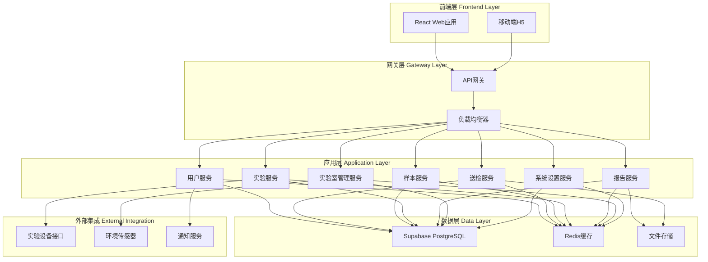
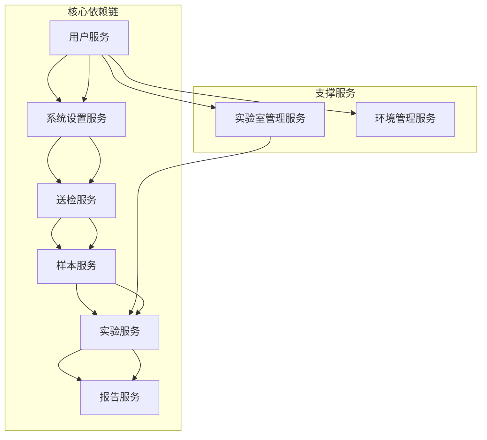
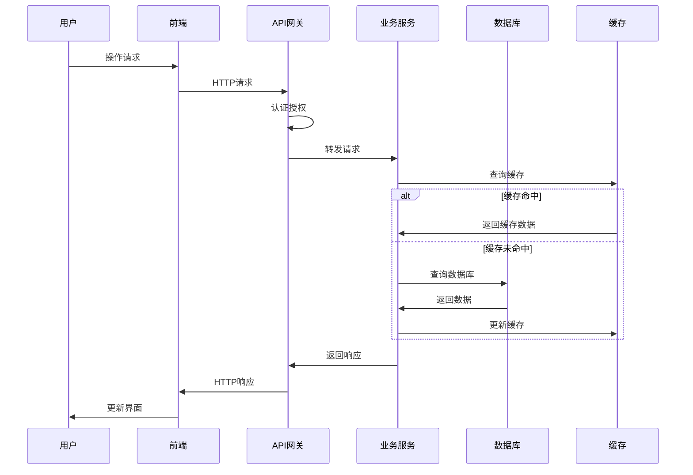
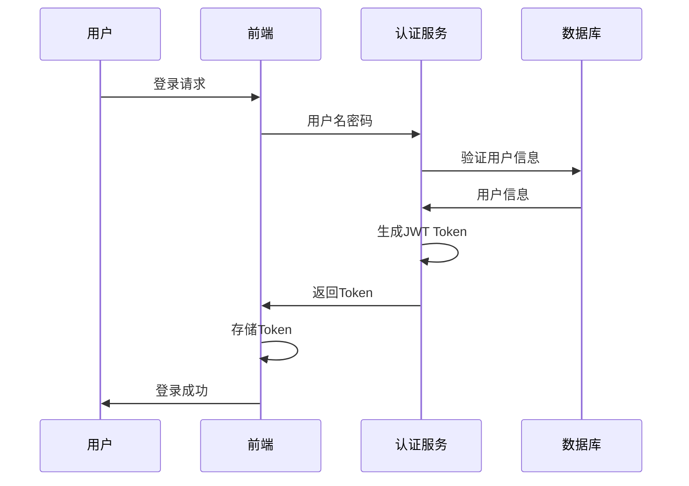
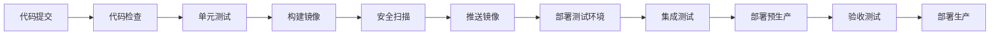

# SmartLis 智能实验室管理系统架构设计文档

## 1. 系统总体架构设计

### 1.1 架构概述

SmartLis 采用现代化的前后端分离架构，结合微服务设计理念，构建高可用、高扩展、高性能的智能实验室管理系统。



### 1.2 分层架构设计

#### 1.2.1 表现层（Presentation Layer）
- **Web前端**：基于React + TypeScript + Ant Design构建的单页应用
- **移动端**：响应式设计，支持移动设备访问
- **组件库**：统一的UI组件库，确保界面一致性

#### 1.2.2 网关层（Gateway Layer）
- **API网关**：统一入口，路由分发，协议转换
- **负载均衡**：请求分发，故障转移
- **安全网关**：认证授权，请求限流，安全防护

#### 1.2.3 业务层（Business Layer）
- **微服务架构**：按业务域拆分的独立服务
- **服务治理**：服务注册发现，健康检查
- **业务逻辑**：核心业务处理，规则引擎

#### 1.2.4 数据层（Data Layer）
- **关系数据库**：Supabase PostgreSQL，存储结构化数据
- **缓存层**：Redis，提升查询性能
- **文件存储**：对象存储，处理文档和图片

### 1.3 微服务架构设计

#### 1.3.1 服务拆分原则
- **业务边界清晰**：按照业务域进行服务拆分
- **数据独立**：每个服务拥有独立的数据存储
- **接口标准化**：统一的API设计规范
- **服务自治**：独立开发、部署、扩展

#### 1.3.2 核心微服务

| 服务名称 | 职责范围 | 数据库表 | 依赖服务 |
|---------|----------|----------|----------|
| 用户服务 | 用户管理、认证授权、权限控制 | users, roles, permissions | 无 |
| 送检服务 | 送检申请、进度跟踪、报告交付 | submissions, submission_progress | 用户服务、系统设置服务 |
| 样本服务 | 样本接收、出入库、销毁管理 | samples, sample_operations | 送检服务、系统设置服务 |
| 实验服务 | 普检、质谱、特检实验管理 | experiments, experiment_data | 样本服务、实验室管理服务 |
| 报告服务 | 报告编辑、生成、审核、交付 | reports, report_templates | 实验服务、用户服务 |
| 实验室管理服务 | 设备管理、耗材管理 | equipment, consumables | 用户服务 |
| 系统设置服务 | 基础配置、参数管理 | system_configs, test_items | 用户服务 |

## 2. 技术选型确认

### 2.1 前端技术栈

#### 2.1.1 核心框架
- **React 18**：现代化前端框架，支持并发特性
- **TypeScript 5.x**：类型安全，提升开发效率
- **Vite 5.x**：快速构建工具，热更新支持

#### 2.1.2 UI组件库
- **Ant Design 5.x**：企业级UI组件库
- **Ant Design Pro**：中后台解决方案
- **@ant-design/icons**：图标库

#### 2.1.3 状态管理
- **Zustand**：轻量级状态管理库
- **React Query**：服务端状态管理
- **Immer**：不可变数据处理

#### 2.1.4 路由管理
- **React Router 6**：声明式路由
- **路由守卫**：权限控制

#### 2.1.5 工具库
- **Axios**：HTTP客户端
- **Day.js**：日期处理
- **Lodash**：工具函数库
- **Echarts**：图表库

### 2.2 后端技术栈

#### 2.2.1 核心框架
- **Java 17**：LTS版本，性能优化
- **Spring Boot 3.x**：微服务框架
- **Spring Security 6.x**：安全框架
- **Spring Data JPA**：数据访问层

#### 2.2.2 数据库技术
- **Supabase PostgreSQL**：主数据库
- **Redis 7.x**：缓存和会话存储
- **HikariCP**：数据库连接池

#### 2.2.3 微服务组件
- **Spring Cloud Gateway**：API网关
- **Spring Cloud LoadBalancer**：负载均衡
- **Resilience4j**：熔断器

#### 2.2.4 工具库
- **MapStruct**：对象映射
- **Validation API**：参数校验
- **Jackson**：JSON处理
- **Apache POI**：Office文档处理

### 2.3 数据库技术

#### 2.3.1 主数据库
- **Supabase PostgreSQL 15**：关系型数据库
- **连接池**：HikariCP连接池管理
- **事务管理**：Spring事务管理

#### 2.3.2 缓存技术
- **Redis 7.x**：内存数据库
- **Spring Cache**：缓存抽象
- **Redisson**：分布式锁

#### 2.3.3 文件存储
- **Supabase Storage**：对象存储服务
- **文件类型**：PDF、Word、Excel、图片
- **CDN加速**：静态资源加速

### 2.4 开发工具

#### 2.4.1 开发环境
- **IDE**：IntelliJ IDEA / VS Code
- **JDK**：OpenJDK 17
- **Node.js**：v18+
- **Maven**：项目构建工具

#### 2.4.2 代码质量
- **ESLint**：前端代码检查
- **Prettier**：代码格式化
- **SonarQube**：代码质量分析
- **Checkstyle**：Java代码规范

#### 2.4.3 测试工具
- **Jest**：前端单元测试
- **JUnit 5**：后端单元测试
- **Mockito**：Mock框架
- **Testcontainers**：集成测试

## 3. 模块架构设计

### 3.1 前端模块架构

#### 3.1.1 目录结构
```
src/
├── components/          # 公共组件
│   ├── Layout/         # 布局组件
│   ├── Form/           # 表单组件
│   └── Table/          # 表格组件
├── pages/              # 页面组件
│   ├── Dashboard/      # 首页
│   ├── Submission/     # 送检管理
│   ├── Sample/         # 样本管理
│   ├── Experiment/     # 实验管理
│   ├── Report/         # 报告管理
│   ├── Laboratory/     # 实验室管理
│   ├── Environment/    # 环境管理
│   ├── User/           # 用户管理
│   └── Settings/       # 系统设置
├── services/           # API服务
├── stores/             # 状态管理
├── utils/              # 工具函数
├── hooks/              # 自定义Hook
├── types/              # TypeScript类型
└── constants/          # 常量定义
```

#### 3.1.2 组件设计原则
- **组件复用**：抽象公共组件，提高复用性
- **状态管理**：合理使用本地状态和全局状态
- **性能优化**：懒加载、虚拟滚动、缓存策略
- **类型安全**：完整的TypeScript类型定义

### 3.2 后端模块架构

#### 3.2.1 项目结构
```
src/main/java/com/smartlis/
├── common/             # 公共模块
│   ├── config/        # 配置类
│   ├── exception/     # 异常处理
│   ├── utils/         # 工具类
│   └── constants/     # 常量定义
├── security/           # 安全模块
│   ├── jwt/           # JWT处理
│   ├── auth/          # 认证授权
│   └── permission/    # 权限控制
├── user/              # 用户服务
│   ├── controller/    # 控制器
│   ├── service/       # 业务逻辑
│   ├── repository/    # 数据访问
│   ├── entity/        # 实体类
│   └── dto/           # 数据传输对象
├── submission/        # 送检服务
├── sample/            # 样本服务
├── experiment/        # 实验服务
├── report/            # 报告服务
├── laboratory/        # 实验室管理服务
└── settings/          # 系统设置服务
```

#### 3.2.2 分层架构
- **Controller层**：接收HTTP请求，参数校验，响应处理
- **Service层**：业务逻辑处理，事务管理
- **Repository层**：数据访问，数据库操作
- **Entity层**：数据实体，JPA映射
- **DTO层**：数据传输对象，接口交互

### 3.3 模块间依赖关系



#### 3.3.1 依赖关系说明
- **用户服务**：基础服务，被所有业务服务依赖
- **系统设置服务**：配置服务，为业务服务提供基础配置
- **核心业务链**：送检→样本→实验→报告的业务流程依赖
- **支撑服务**：实验室管理和环境管理为实验服务提供支撑

### 3.4 接口设计规范

#### 3.4.1 RESTful API设计
- **URL设计**：`/api/v1/{service}/{resource}`
- **HTTP方法**：GET（查询）、POST（创建）、PUT（更新）、DELETE（删除）
- **状态码**：标准HTTP状态码
- **响应格式**：统一的JSON响应格式

#### 3.4.2 统一响应格式
```json
{
  "code": 200,
  "message": "success",
  "data": {},
  "timestamp": "2024-01-01T00:00:00Z"
}
```

#### 3.4.3 错误处理
```json
{
  "code": 400,
  "message": "参数错误",
  "errors": [
    {
      "field": "name",
      "message": "名称不能为空"
    }
  ],
  "timestamp": "2024-01-01T00:00:00Z"
}
```

## 4. 数据架构设计

### 4.1 数据流设计

#### 4.1.1 核心业务数据流


#### 4.1.2 数据同步策略
- **实时同步**：关键业务数据实时更新
- **异步同步**：非关键数据异步处理
- **事件驱动**：基于事件的数据同步机制
- **最终一致性**：分布式数据一致性保证

### 4.2 缓存策略

#### 4.2.1 缓存层次
- **浏览器缓存**：静态资源缓存
- **CDN缓存**：全局内容分发
- **应用缓存**：业务数据缓存
- **数据库缓存**：查询结果缓存

#### 4.2.2 缓存策略
- **Cache-Aside**：旁路缓存模式
- **Write-Through**：写透缓存模式
- **Write-Behind**：写回缓存模式
- **TTL策略**：基于时间的缓存过期

#### 4.2.3 缓存配置
```yaml
redis:
  # 用户会话缓存
  session:
    ttl: 7200  # 2小时
    prefix: "session:"
  
  # 业务数据缓存
  business:
    ttl: 3600  # 1小时
    prefix: "biz:"
  
  # 系统配置缓存
  config:
    ttl: 86400  # 24小时
    prefix: "config:"
```

### 4.3 文件存储方案

#### 4.3.1 存储分类
- **文档存储**：PDF、Word、Excel文件
- **图片存储**：JPG、PNG、GIF图片
- **临时文件**：上传临时文件
- **备份文件**：数据备份文件

#### 4.3.2 存储策略
- **分桶存储**：按文件类型分桶管理
- **CDN加速**：静态文件CDN分发
- **访问控制**：基于权限的文件访问
- **生命周期**：自动清理过期文件

#### 4.3.3 文件命名规范
```
{bucket}/{year}/{month}/{day}/{uuid}.{extension}
例如：documents/2024/01/01/550e8400-e29b-41d4-a716-446655440000.pdf
```

## 5. 安全架构设计

### 5.1 认证授权机制

#### 5.1.1 认证流程


#### 5.1.2 JWT Token设计
```json
{
  "header": {
    "alg": "HS256",
    "typ": "JWT"
  },
  "payload": {
    "sub": "user_id",
    "username": "用户名",
    "roles": ["ROLE_USER"],
    "permissions": ["READ_SAMPLE", "WRITE_SAMPLE"],
    "exp": 1640995200,
    "iat": 1640908800
  }
}
```

#### 5.1.3 权限控制模型
- **RBAC模型**：基于角色的访问控制
- **资源权限**：细粒度的资源访问控制
- **数据权限**：基于数据范围的权限控制
- **操作权限**：基于操作类型的权限控制

### 5.2 数据安全策略

#### 5.2.1 数据加密
- **传输加密**：HTTPS/TLS 1.3
- **存储加密**：敏感数据AES-256加密
- **密码加密**：BCrypt哈希算法
- **密钥管理**：密钥轮换和安全存储

#### 5.2.2 数据脱敏
- **日志脱敏**：敏感信息日志脱敏
- **接口脱敏**：API响应数据脱敏
- **导出脱敏**：数据导出脱敏处理
- **测试脱敏**：测试环境数据脱敏

#### 5.2.3 数据备份
- **定时备份**：每日自动备份
- **增量备份**：基于变更的增量备份
- **异地备份**：多地域备份存储
- **恢复测试**：定期备份恢复测试

### 5.3 API安全设计

#### 5.3.1 接口安全
- **认证检查**：所有接口需要认证
- **权限验证**：基于权限的接口访问
- **参数校验**：严格的参数校验
- **SQL注入防护**：参数化查询

#### 5.3.2 安全防护
- **请求限流**：基于用户和IP的限流
- **防重放攻击**：请求签名和时间戳
- **CSRF防护**：CSRF Token验证
- **XSS防护**：输入输出过滤

#### 5.3.3 安全监控
- **访问日志**：详细的访问日志记录
- **异常监控**：异常行为实时监控
- **安全告警**：安全事件自动告警
- **审计跟踪**：完整的操作审计链

## 6. 部署架构设计

### 6.1 环境规划

#### 6.1.1 环境分类
- **开发环境（DEV）**：开发人员本地开发
- **测试环境（TEST）**：功能测试和集成测试
- **预生产环境（STAGING）**：生产前验证
- **生产环境（PROD）**：正式生产环境

#### 6.1.2 环境配置
| 环境 | 服务器配置 | 数据库 | 缓存 | 存储 |
|------|------------|--------|------|------|
| DEV | 2C4G | Supabase Dev | Redis单机 | 本地存储 |
| TEST | 4C8G | Supabase Test | Redis单机 | 云存储 |
| STAGING | 8C16G | Supabase Staging | Redis集群 | 云存储 |
| PROD | 16C32G | Supabase Prod | Redis集群 | 云存储+CDN |

### 6.2 容器化部署

#### 6.2.1 Docker镜像
```dockerfile
# 前端镜像
FROM node:18-alpine AS frontend
WORKDIR /app
COPY package*.json ./
RUN npm ci --only=production
COPY . .
RUN npm run build

FROM nginx:alpine
COPY --from=frontend /app/dist /usr/share/nginx/html
COPY nginx.conf /etc/nginx/nginx.conf
EXPOSE 80

# 后端镜像
FROM openjdk:17-jre-slim
WORKDIR /app
COPY target/smartlis-*.jar app.jar
EXPOSE 8080
ENTRYPOINT ["java", "-jar", "app.jar"]
```

#### 6.2.2 Docker Compose
```yaml
version: '3.8'
services:
  frontend:
    build: ./frontend
    ports:
      - "80:80"
    depends_on:
      - backend
  
  backend:
    build: ./backend
    ports:
      - "8080:8080"
    environment:
      - SPRING_PROFILES_ACTIVE=prod
      - DATABASE_URL=${DATABASE_URL}
      - REDIS_URL=${REDIS_URL}
    depends_on:
      - redis
  
  redis:
    image: redis:7-alpine
    ports:
      - "6379:6379"
    volumes:
      - redis_data:/data

volumes:
  redis_data:
```

### 6.3 CI/CD流程设计

#### 6.3.1 CI流程


#### 6.3.2 GitHub Actions配置
```yaml
name: CI/CD Pipeline

on:
  push:
    branches: [ main, develop ]
  pull_request:
    branches: [ main ]

jobs:
  test:
    runs-on: ubuntu-latest
    steps:
      - uses: actions/checkout@v3
      - name: Setup Node.js
        uses: actions/setup-node@v3
        with:
          node-version: '18'
      - name: Install dependencies
        run: npm ci
      - name: Run tests
        run: npm test
      - name: Build
        run: npm run build
  
  deploy:
    needs: test
    runs-on: ubuntu-latest
    if: github.ref == 'refs/heads/main'
    steps:
      - name: Deploy to production
        run: |
          # 部署脚本
```

### 6.4 监控和日志

#### 6.4.1 监控指标
- **系统监控**：CPU、内存、磁盘、网络
- **应用监控**：响应时间、吞吐量、错误率
- **业务监控**：关键业务指标监控
- **用户监控**：用户行为和体验监控

#### 6.4.2 日志管理
- **日志收集**：统一日志收集
- **日志存储**：结构化日志存储
- **日志分析**：日志查询和分析
- **日志告警**：异常日志自动告警

## 7. 性能架构设计

### 7.1 性能优化策略

#### 7.1.1 前端性能优化
- **代码分割**：按路由和组件分割代码
- **懒加载**：组件和路由懒加载
- **缓存策略**：浏览器缓存和HTTP缓存
- **资源优化**：图片压缩、CSS/JS压缩
- **CDN加速**：静态资源CDN分发

#### 7.1.2 后端性能优化
- **数据库优化**：索引优化、查询优化
- **缓存策略**：多级缓存架构
- **连接池**：数据库连接池优化
- **异步处理**：非阻塞IO和异步任务
- **负载均衡**：请求分发和故障转移

#### 7.1.3 数据库性能优化
- **索引设计**：合理的索引设计
- **查询优化**：SQL查询优化
- **分区表**：大表分区策略
- **读写分离**：主从复制和读写分离
- **连接优化**：连接池和连接复用

### 7.2 扩展性设计

#### 7.2.1 水平扩展
- **无状态设计**：应用服务无状态化
- **负载均衡**：多实例负载均衡
- **数据分片**：数据库水平分片
- **缓存集群**：Redis集群部署

#### 7.2.2 垂直扩展
- **服务器升级**：CPU、内存、存储升级
- **数据库升级**：数据库性能提升
- **网络优化**：网络带宽和延迟优化

### 7.3 容量规划

#### 7.3.1 用户容量
- **并发用户**：支持100个并发用户
- **日活用户**：支持500个日活用户
- **峰值处理**：支持3倍峰值流量

#### 7.3.2 数据容量
- **数据增长**：年数据增长50%
- **存储容量**：初期100GB，3年内1TB
- **备份容量**：3倍数据容量用于备份

#### 7.3.3 性能指标
- **响应时间**：页面加载<3秒，API响应<2秒
- **吞吐量**：支持1000 QPS
- **可用性**：99.5%系统可用性
- **恢复时间**：故障恢复时间<30分钟

### 7.4 监控方案

#### 7.4.1 性能监控
- **APM工具**：应用性能监控
- **基础监控**：服务器资源监控
- **业务监控**：关键业务指标
- **用户体验**：真实用户监控

#### 7.4.2 告警机制
- **阈值告警**：基于阈值的自动告警
- **异常检测**：基于机器学习的异常检测
- **告警通道**：邮件、短信、钉钉通知
- **告警升级**：告警升级和处理流程

## 8. 技术风险评估

### 8.1 技术风险识别

#### 8.1.1 架构风险
- **单点故障**：关键组件单点故障风险
- **性能瓶颈**：系统性能瓶颈风险
- **扩展性限制**：架构扩展性限制
- **技术债务**：技术选型和实现债务

#### 8.1.2 安全风险
- **数据泄露**：敏感数据泄露风险
- **权限绕过**：权限控制绕过风险
- **注入攻击**：SQL注入和XSS攻击
- **DDoS攻击**：分布式拒绝服务攻击

#### 8.1.3 运维风险
- **部署失败**：部署过程失败风险
- **数据丢失**：数据备份和恢复风险
- **服务中断**：服务不可用风险
- **监控盲区**：监控覆盖不全风险

### 8.2 风险缓解措施

#### 8.2.1 高可用设计
- **冗余部署**：关键组件冗余部署
- **故障转移**：自动故障转移机制
- **健康检查**：服务健康状态检查
- **熔断降级**：服务熔断和降级

#### 8.2.2 安全防护
- **多层防护**：多层次安全防护体系
- **安全审计**：定期安全审计和渗透测试
- **应急响应**：安全事件应急响应预案
- **安全培训**：开发人员安全培训

#### 8.2.3 运维保障
- **自动化部署**：CI/CD自动化部署
- **监控告警**：全面的监控告警体系
- **备份恢复**：完善的备份恢复机制
- **应急预案**：详细的应急处理预案

## 9. 总结

### 9.1 架构特点

- **现代化技术栈**：采用React、Spring Boot等现代化技术
- **微服务架构**：按业务域拆分的微服务架构
- **前后端分离**：清晰的前后端分离设计
- **云原生设计**：基于云服务的架构设计
- **安全优先**：全面的安全防护体系
- **高可用性**：多层次的高可用保障
- **可扩展性**：良好的水平和垂直扩展能力

### 9.2 技术优势

- **开发效率**：现代化工具链提升开发效率
- **维护性**：清晰的架构和代码结构
- **性能**：多级缓存和优化策略
- **安全性**：完善的安全防护机制
- **稳定性**：高可用和容错设计
- **扩展性**：支持业务快速发展

### 9.3 实施建议

- **分阶段实施**：按照优先级分阶段实施
- **技术验证**：关键技术提前验证
- **团队培训**：技术栈培训和知识分享
- **代码规范**：建立完善的代码规范
- **持续优化**：持续的架构优化和改进

本架构设计为SmartLis智能实验室管理系统提供了完整的技术指导，确保系统的可靠性、安全性、性能和可扩展性，为后续的开发和运维工作奠定了坚实的基础。